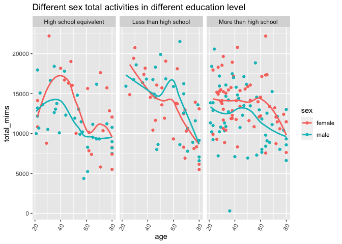
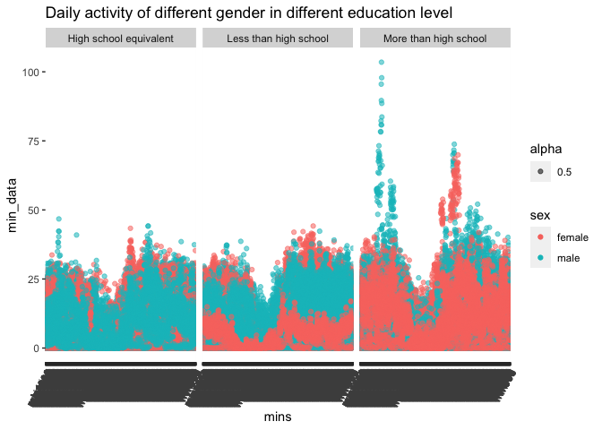

p8105_hw3_wz2675
================
Wenyu Zhang
2023-10-08

# Problem 1

``` r
data("instacart")
instacart = 
  instacart |> 
  as_tibble()
```

In this dataset, there are in total 1384617 observations and 15
variables. Each observations represent a specific product from a
instacart order. Inside the whole dataset, the product are gathered from
different aisles from different department. Also, there is a variable
called `order_id` representing the order confirmation number, in other
words representing different orders made online. There are also
`product_id` that helped tracking different order by numeric value,
which is more convenient when gathering all the data at the end. There
are multiple NAs inside the dataset. So, if we wish to do some data
cleaning and visualization, we need to take into consideration with
these NAs whether to clean-up them or bring them inside our calculation
and visualization.

``` r
instacart |> 
  count(aisle) |> 
  arrange(desc(n))
```

    ## # A tibble: 134 × 2
    ##    aisle                              n
    ##    <chr>                          <int>
    ##  1 fresh vegetables              150609
    ##  2 fresh fruits                  150473
    ##  3 packaged vegetables fruits     78493
    ##  4 yogurt                         55240
    ##  5 packaged cheese                41699
    ##  6 water seltzer sparkling water  36617
    ##  7 milk                           32644
    ##  8 chips pretzels                 31269
    ##  9 soy lactosefree                26240
    ## 10 bread                          23635
    ## # ℹ 124 more rows

This code chunk provide a table for all the aisles in instacart and a
related order number from each aisles that bought from instacart. In
total there are 134 aisles in instacart and the most items are ordered
from fresh vegetables aisle.

``` r
instacart |> 
  count(aisle) |> 
  filter(n > 10000) |> 
  mutate(aisle = fct_reorder(aisle, n)) |> 
  ggplot(aes(x = aisle, y = n)) + 
  geom_point() + 
  labs(title = "Number of items ordered in each aisle") +
  theme(axis.text.x = element_text(angle = 60, hjust = 1))
```

<!-- -->

This produces a graph that gives us a distribution scatter plot
representing orders from aisles that have more than 10000 items
purchased in those aisles. The order provided is in ascending order.

``` r
instacart |> 
  filter(aisle %in% c("baking ingredients", "dog food care", "packaged vegetables fruits")) |> 
  group_by(aisle) |> 
  count(product_name) |> 
  mutate(rank = min_rank(desc(n))) |> 
  filter(rank < 4) |>
  arrange(desc(n)) |> 
  knitr::kable()
```

| aisle                      | product_name                                  |    n | rank |
|:---------------------------|:----------------------------------------------|-----:|-----:|
| packaged vegetables fruits | Organic Baby Spinach                          | 9784 |    1 |
| packaged vegetables fruits | Organic Raspberries                           | 5546 |    2 |
| packaged vegetables fruits | Organic Blueberries                           | 4966 |    3 |
| baking ingredients         | Light Brown Sugar                             |  499 |    1 |
| baking ingredients         | Pure Baking Soda                              |  387 |    2 |
| baking ingredients         | Cane Sugar                                    |  336 |    3 |
| dog food care              | Snack Sticks Chicken & Rice Recipe Dog Treats |   30 |    1 |
| dog food care              | Organix Chicken & Brown Rice Recipe           |   28 |    2 |
| dog food care              | Small Dog Biscuits                            |   26 |    3 |

This table provide the number of top three favorite items in the
desinated aisles `baking ingredients`, `dog food care`, and
`packaged vegetables fruits`. The acutal number of the orders and names
of the items are given in the table.

``` r
instacart |> 
  filter(product_name %in% c("Pink Lady Apples", "Coffee Ice Cream")) |> 
  group_by(product_name, order_dow) |> 
  summarise(mean_hour = mean(order_hour_of_day)) |> 
  pivot_wider(
    names_from = order_dow,
    values_from = mean_hour
  ) |> 
  knitr::kable(digits = 2)
```

    ## `summarise()` has grouped output by 'product_name'. You can override using the
    ## `.groups` argument.

| product_name     |     0 |     1 |     2 |     3 |     4 |     5 |     6 |
|:-----------------|------:|------:|------:|------:|------:|------:|------:|
| Coffee Ice Cream | 13.77 | 14.32 | 15.38 | 15.32 | 15.22 | 12.26 | 13.83 |
| Pink Lady Apples | 13.44 | 11.36 | 11.70 | 14.25 | 11.55 | 12.78 | 11.94 |

This code chunk provide a table showing the `Pink Lady Apples` and
`Coffee Ice Cream` are ordered on each day of the week within the mean
hour of the day. The table gives 6 observations in a 2 \* 7 table.

# Problem 2

``` r
data("brfss_smart2010")

clean_brfss = brfss_smart2010 |> 
  janitor::clean_names() |> 
  filter(topic == "Overall Health",
         response %in% c("Excellent", "Very good", "Good", "Fair", "Poor")) |> 
  mutate(response = fct_reorder(response, response))
```

First, I perform some data cleaning. I regulate the variables’ names for
better manipulation in the future coding, and selected the topic that we
are interested in, which is `Overall Health`. Also, I rearrange the
response level from `Poor` to `Excellent` and swtich them into factor
variables.

``` r
seven_more_2002 = clean_brfss |> 
  filter(year == 2002) |> 
  group_by(locationabbr) |> 
  summarise(n_location = n_distinct(locationdesc)) |> 
  filter(n_location >= 7)

seven_more_2010 = clean_brfss |> 
  filter(year == 2010) |> 
  group_by(locationabbr) |> 
  summarise(n_location = n_distinct(locationdesc)) |> 
  filter(n_location >= 7)
```

This two table shows the states that observed with 7 or more locations
in 2002 and 2010. In 2002, the states observed with 7 or more locations
are CT, FL, MA, NC, NJ, PA. In 2010, the states we are interested in are
CA, CO, FL, MA, MD, NC, NE, NJ, NY, OH, PA, SC, TX, WA.

``` r
excellent_response = clean_brfss |> 
  filter(response == "Excellent") |> 
  group_by(locationabbr, year) |> 
  mutate(mean_data = mean(data_value)) |> 
  select(year, locationabbr, mean_data)

excellent_response |> 
  ggplot(aes(x = year, y = mean_data, color = locationabbr)) +
  geom_line()
```

    ## Warning: Removed 65 rows containing missing values (`geom_line()`).

<!-- -->

In this code chunk, we focusing on the mean value of `data_value`
variable in different state within different years. So we make a table
composed of all three variables that we are focusing on. And then we
composed a “spaghetti” plot. We noticed that each state have have
different distribution and the overall trend is flat, which means there
is less changes from year to year.

``` r
clean_brfss |> 
  filter(locationabbr == "NY" & year %in% c(2006, 2010)) |> 
  group_by(locationdesc) |> 
  ggplot(aes(x = response, y = data_value)) +
  geom_boxplot() +
  facet_grid(~year)
```

<!-- -->

Finally, we made a boxplot considering the distribution of `data_value`
within each response level in 2006 and 2010 in the New York City. We
noticed that compared with 2006, in 2010 there appears a larger range of
`Very good` and `Poor` level and a shrinking `Good` level in our graph.

# Problem 3

``` r
nhanes_covar = read_csv("./data/nhanes_covar.csv", skip = 4)
```

    ## Rows: 250 Columns: 5
    ## ── Column specification ────────────────────────────────────────────────────────
    ## Delimiter: ","
    ## dbl (5): SEQN, sex, age, BMI, education
    ## 
    ## ℹ Use `spec()` to retrieve the full column specification for this data.
    ## ℹ Specify the column types or set `show_col_types = FALSE` to quiet this message.

``` r
nhanes_accel = read.csv("./data/nhanes_accel.csv")

nhanes_covar = nhanes_covar |> 
  drop_na() |> 
  mutate(sex = recode(sex, "1" = "male", "2" = "female"),
         education = recode(education, 
                            "1" = "Less than high school",
                            "2" = "High school equivalent",
                            "3" = "More than high school"),
         education = fct_reorder(education, education)) |> 
  filter(age >= 21)

nhanes_data = 
  left_join(nhanes_covar, nhanes_accel, by = "SEQN") |> 
  janitor::clean_names()
```

To better investigate the dataset, we first need to do some data
cleaning. We first translate the numeric value representing the sex and
education level to factor variables and we filtered out the people that
are younger than 21 years old. Next we combine the accelerometer data
with this dataset to complete data cleaning. After that, what we need to
do is to drop the missing values that might interrupt our trendency.

``` r
nhanes_data |> 
  group_by(sex, education) |> 
  summarise(n_observation = n()) |> 
  knitr::kable()
```

    ## `summarise()` has grouped output by 'sex'. You can override using the `.groups`
    ## argument.

| sex    | education              | n_observation |
|:-------|:-----------------------|--------------:|
| female | High school equivalent |            23 |
| female | Less than high school  |            28 |
| female | More than high school  |            59 |
| male   | High school equivalent |            35 |
| male   | Less than high school  |            27 |
| male   | More than high school  |            56 |

``` r
nhanes_data |> 
  group_by(sex, education) |> 
  summarise(n_observation = n()) |> 
  ggplot(aes(x = education, y = n_observation)) +
  geom_bar(stat = "identity") + 
  facet_grid(~sex) +
  labs(title = "Males and females education level distribution") +
  theme(axis.text.x = element_text(angle = 60, hjust = 1))
```

    ## `summarise()` has grouped output by 'sex'. You can override using the `.groups`
    ## argument.

<!-- -->

In this code chunk, we are focusing on the distribution of males and
females within different education level. So, we make a table that
includes the number of people within three different education level
with different gender. Also, we attached a graph for better
visualization. From the graph and the table, we noticed that most males
and females have a education level that equivalent or higher than high
school. Among them, males have more people falls in the category of
equivalent to high school education level.

``` r
nhanes_data |> 
  mutate(total_mims = rowSums(nhanes_data[6:1445])) |> 
  ggplot(aes(x = age, y = total_mims, color = sex)) +
  geom_point() +
  geom_smooth(se = FALSE) +
  facet_grid(~education) +
  labs(title = "Different sex total activities in different education level") +
  theme(axis.text.x = element_text(angle = 60, hjust = 1))
```

    ## `geom_smooth()` using method = 'loess' and formula = 'y ~ x'

<!-- -->

In this part, we make a scatter plot with smooth trend line that
represent the aggregated value of each minute activity versus the year.
In this graph we separate the category of each gender and three
different education level. From the graph, we see that high school
equivalent males and females have a higher activity around the age of 40
with females higher than males. And there is the same condition for
people in less than high school category in their 60s with males greater
than females. For more than high school, the trend is somehow flat and
uniform.

``` r
nhanes_data |> 
  pivot_longer(cols = starts_with("min"),
               names_to = "mins",
               values_to = "min_data") |> 
  ggplot(aes(x = mins, y = min_data)) +
  geom_point(aes(color = sex, alpha = .5)) +
  geom_smooth(se = FALSE) +
  facet_grid(~education) +
  labs(title = "Daily activity of different gender in different education level") +
  theme(axis.text.x = element_text(angle = 60, hjust = 1))
```

    ## `geom_smooth()` using method = 'loess' and formula = 'y ~ x'

<!-- -->

In this question, we are looking for a pattern of people’s daily
activity spreaded into minutes. From the graph we made, we noticed that
both males and females experiences a “gap” period in the middle of the
day. For males have a education level of more than high school, they
have a higher activity level in the morning and early evening compared
with females.
